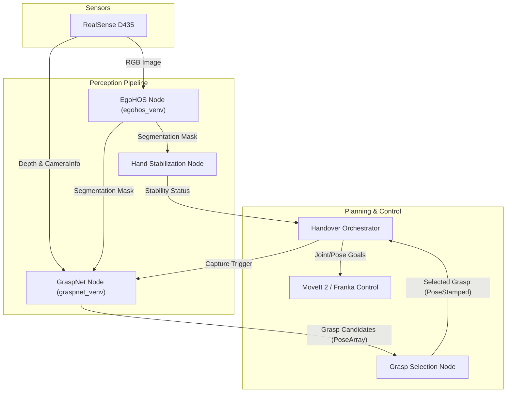

# H2R Handovers

Human-to-Robot handover pipeline for the Franka Emika Panda, built on ROS 2 Humble.

A human holds out an object, the system segments the hand and object using [EgoHOS](https://github.com/YaraShahin/EgoHOS), generates grasp candidates with [GraspNet](https://github.com/YaraShahin/graspnet-baseline), selects the optimal grasp via configurable policies, and safely commands the robot to take the object.

## Architecture

The system is composed of a perception pipeline that processes RGB-D data to understand the scene, and a planning and control pipeline that orchestrates the robot's motion. The architecture relies on isolated virtual environments for deep learning models to prevent dependency conflicts, communicating via ROS 2 topics.



### Core Components

#### 1. Perception Pipeline
- **EgoHOS Node (`EgoHOS/scripts/driver.py`)**: Runs in a dedicated virtual environment (`egohos_venv`). It subscribes to the RGB image stream and uses a 3-stage cascaded segmentation model to identify hands, contact boundaries, and objects. It outputs a `segmentation_mask` where pixels are labeled as background (0), hand (1), or object (2).
- **Hand Stabilization Node (`h2r_handovers`)**: Analyzes the `segmentation_mask` over time. It calculates the centroid of the hand and tracks its movement. Once the hand remains within a defined pixel tolerance for a specific number of frames, it publishes a `hand_stable` status to trigger the handover. It acts as the intent-recognition trigger for the system.
- **GraspNet Node (`graspnet-baseline/scripts/driver.py`)**: Runs in its own isolated environment (`graspnet_venv`). It waits for a capture trigger from the orchestrator. Once triggered, it synchronizes the latest RGB mask, aligned depth image, and camera intrinsics. It masks out the human hand and background, generates a 3D point cloud of the object, and infers a dense set of 6-DOF grasp poses using GraspNet-1B. It publishes these as a scored `PoseArray`.

#### 2. Planning & Control
- **Grasp Selection Node (`h2r_handovers`)**: Subscribes to the raw array of grasp candidates generated by GraspNet. It applies configurable policies (e.g., `ergonomic`, `highest_score`, `top_down`, `nearest_depth`) to filter and select the single most appropriate grasp for the situation. It then publishes this as a `selected_grasp`.
- **Handover Orchestrator (`h2r_handovers`)**: The central state machine of the system. It governs the high-level logic:
  - Monitors hand stability to auto-trigger captures.
  - Receives the selected grasp and transforms it into the robot's planning frame.
  - Sequences the Franka Panda through the physical handover: opening the gripper, moving to a pre-grasp pose, performing a linear final approach, closing the gripper, waiting for the human to release, and finally retreating to a safe drop-off location.
- **MoveIt / Franka ROS 2**: Handles the low-level kinematics, trajectory generation, and collision avoidance (including a defined table collision object). The orchestrator interfaces with these via Action servers.

---

## Trigger Modes

The pipeline behavior is controlled by the `trigger_mode` parameter in `config/handover_params.yaml`:

- **Auto Mode (`"auto"`) - Default**: The orchestrator constantly monitors the `hand_stability_status` topic. When a stable hand is detected, it automatically fires the capture sequence to process the handover. You can still manually press `Enter` in the terminal to force a capture.
- **Manual Mode (`"manual"`)**: The system waits for the operator to press `Enter` in the orchestrator terminal before initiating the capture sequence.

---

## Workspace Setup

### Prerequisites
- Ubuntu 22.04 + RT kernel
- ROS 2 Humble
- CUDA ≥ 11.3
- Franka FCI firmware 4.2.2 / libfranka 0.9.2 (LCAS fork)

### 1. Clone the Workspace
```bash
mkdir -p ~/handover_ws/src && cd ~/handover_ws/src
git clone https://github.com/<your-org>/h2r_handovers.git
vcs import < h2r_handovers/humble.repos
```

### 2. Install EgoHOS (Segmentation)
The EgoHOS node requires its own isolated virtual environment to avoid dependency conflicts.
```bash
cd ~/handover_ws/src
python3 -m venv --system-site-packages egohos_venv
source egohos_venv/bin/activate
cd EgoHOS
pip install -r requirements.txt
```

Verify PyTorch + CUDA:

```bash
python -c "import torch; print(torch.__version__); x=torch.rand(3).cuda(); print(x+1)"
```

> If CUDA doesn't work, install a matching torch build:
> ```bash
> pip install torch==1.11.0+cu113 torchvision==0.12.0+cu113 \
>     --extra-index-url https://download.pytorch.org/whl/cu113
> ```

Install MMSegmentation:

```bash
pip install -U openmim
mim install mmcv-full==1.6.0
cd mmsegmentation
pip install -v -e .
```

> If `mim install` fails, try the direct wheel:
> ```bash
> pip install mmcv-full==1.6.0 -f https://download.openmmlab.com/mmcv/dist/cu113/torch1.11.0/index.html
> ```

Verify mmcv:

```bash
python -c "import mmcv; from mmcv.ops import nms; print(mmcv.__version__)"
```

Download model weights and test data:

```bash
cd ~/handover_ws/src/EgoHOS
bash download_checkpoints.sh
bash download_datasets.sh    # optional, for offline testing
bash download_testimages.sh  # optional, for offline testing
```

Mark as COLCON_IGNORE:

```bash
touch ~/handover_ws/src/EgoHOS/COLCON_IGNORE
```

### 3. Install GraspNet (Grasp Synthesis)
GraspNet also runs in a dedicated virtual environment.
```bash
cd ~/handover_ws/src
python3 -m venv --system-site-packages graspnet_venv
source graspnet_venv/bin/activate
cd graspnet-baseline
pip install -r requirements.txt
cd pointnet2 && python setup.py install && cd ..
cd knn && python setup.py install && cd ..
pip install graspnetAPI
```

Install PyTorch matching your CUDA:

```bash
pip install torch torchvision torchaudio \
    --extra-index-url https://download.pytorch.org/whl/cu118  # adjust for your CUDA
```

Download pretrained checkpoint (`checkpoint-rs.tar` for RealSense model):

```
Place at: graspnet-baseline/logs/log_rs/checkpoint.tar
```

Mark as COLCON_IGNORE:

```bash
touch ~/handover_ws/src/graspnet-baseline/COLCON_IGNORE
```

### 4. Build the ROS 2 Workspace
```bash
cd ~/handover_ws
colcon build --symlink-install
source install/setup.bash
```

---

## Running the Pipeline

Running the full handover system requires launching the core ROS 2 orchestrator and the two Python-based driver nodes in separate terminals to maintain their virtual environments.

### Terminal 1: Orchestrator & ROS 2 Pipeline
Starts the Realsense camera, hand stabilization, MoveIt, and the main handover state machine.
```bash
source ~/handover_ws/install/setup.bash
ros2 launch h2r_handovers handover.launch.xml
```

### Terminal 2: EgoHOS Driver
Runs the semantic segmentation network.
```bash
source ~/handover_ws/src/egohos_venv/bin/activate
python ~/handover_ws/src/EgoHOS/scripts/driver.py
```

### Terminal 3: GraspNet Driver
Runs the 3D grasp pose synthesis network.
```bash
source ~/handover_ws/src/graspnet_venv/bin/activate
python ~/handover_ws/src/graspnet-baseline/scripts/driver.py
```

### Debugging & Visualization
- Use RViz2 to view the `segmentation_overlay` (EgoHOS output) and `grasp_debug_image` (GraspNet projection).
- Monitor system state via: `ros2 topic echo /system_state`
- Inspect grasp candidates via: `ros2 topic echo /grasp_candidates`